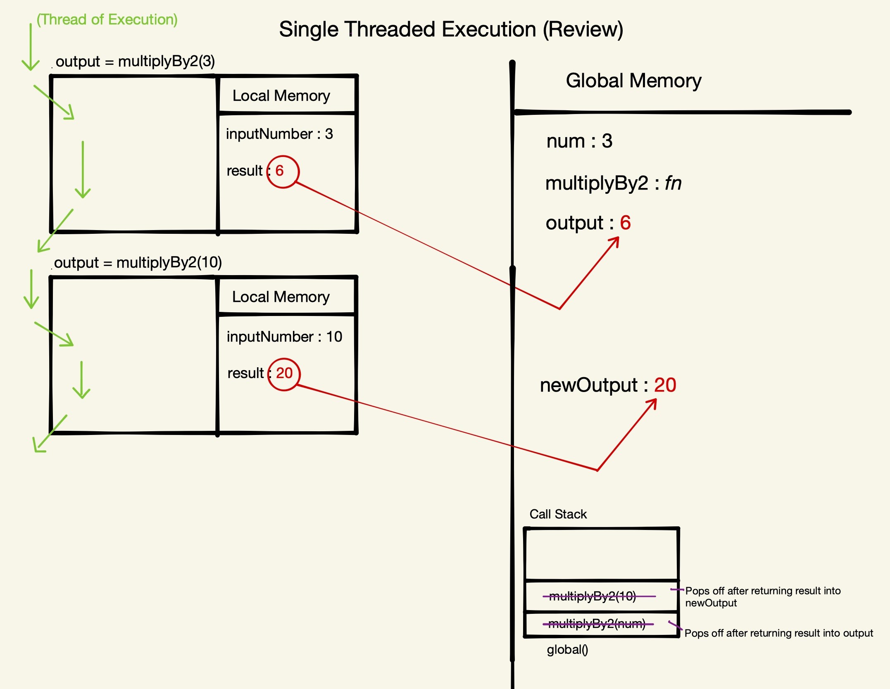

# Section 5: Asynchronous JavaScript

## Single Threaded Execution Review

### Promises, Async & the Event Loop

- Promises: the most signficant ES6 feature
- Asynchronicity: the feature that makes dynamic web applications possible
- The Event Loop: JavaScript’s triage
- Microtask queue, Callback queue and Web Browser features (APIs)

Reference article - [Tasks, microtasks, queues and schedules by Jake Archibald](https://jakearchibald.com/2015/tasks-microtasks-queues-and-schedules/)

### A reminder of how JavaScript executes code

```
const num = 3;
function multiplyBy2 (inputNumber){
	const result = inputNumber*2;
	return result;
}
const output = multiplyBy2(num);
const newOutput = multiplyBy2(10);
```

This is the same code walkthrough we saw in the beginning of the [JavaScript Principles section](./JavaScript-Principles.md). Copying here for posterity:

1. Define constant `num` and assign it the value of `3`.
2. Define function `multiplyBy2()`. When we define a function, there is two parts:
	a. define the label/identifier
	b. store all of the code in the function into memory (we do not execute anything at this point)
3. Define constant `output` and assign it the value returned by `multiplyBy2(num)`. Before we get the returned value from `multiplyBy2(num)`, that constant's value will be "uninitialized".
4. Execute `multiplyBy2(num)`, creating a new Execution Context for that function block. Inside that new Execution Context, we:
	a. Assign `inputNumber` the value of `3`. (`inputNumber` is the placeholder and is referred to as a "Parameter". `3` is the data that gets passed in to that placeholder and is called an "Argument". These two things are fundamentally different things. One is a label and one is the thing that is stored in that label.)
	b. Define constant `result` and assign it the value of the operaton on the right hand side - which is executed and evaluates to `6`.
	c. In our local memory, look up (or locate) the data (_value_) stored with the label `result` and return it (ship it out of the functions Local Execution Context into the Global Execution Context). This function execution ultimately evaluates to the _value_ returned in `result` - in this case, `6`.
5. Assign the returned value of `6` to `output`.
6. Define constant `newOutput` and assign it the value returned by `multiplyBy2(10)`.
7. Repeat step 6 for the new function call. execute `multiplyBy2(10)`, creating a new Execution Context for that function block. Inside that new Execution Context, we:
	a. Assign `inputNumber` the value of `10`.
	b. Define constant `result` and assign it the value of the operaton on the right hand side - which is executed and evaluates to `20`.
	c. In our local memory, look up (or locate) the data stored with the label `result` and return it (ship it out of the functions Local Execution Context into the Global Execution Context). This function execution ultimately evaluates to the value returned in `result` - in this case, `20`.
8. Assign the returned value of `20` to `newOutput`.

Here's the visual example of the above execution:



JavaScript is a synchronous language, meaning that when we are enter a function's Execution Context and run the code inside (line-by-line) we can not exit out and move on until that code is finished running. When we finish running the code inside of a function, we close that Execution Context and move on. _Then_ we hit the next line in Global. What if that line we're running is a really slow task? 😱

## Asynchronicity in JavaScript

Asynchronicity is the backbone of modern web development in JavaScript yet ,as we've mentioned, every single time we have a task to do, we must finish it before we move on. This is because JavaScript is Single-Threaded (one command runs at a time) and Synchronously-Executed (each line is run in order the code appears).

What if we have a task like speaking to a server, to Twitter's server, to get new tweets? We have to sit on that line, and wait for that data to come back. When it comes back, we can display it, and then we can move on to the next line. But that could take like half a second or longer. In that time we can't run any further code afterwards (until the task is complete and we can move along). That's a serious problem. And what if we have code that we want to run using those tweets?

A slow function blocks further code from running:

```
const tweets = getTweets("http://twitter.com/will/1")

// ⛔350ms wait while a request is sent to Twitter HQ
displayTweets(tweets)

// more code to run
console.log("I want to runnnn!")
```

Let's make the situation even more difficult - what if we try to delay a function directly using `setTimeout` (`setTimeout` is a built in function - its first argument is the function to delay followed by ms to delay by)?

```
function printHello(){
	console.log("Hello");
}
setTimeout(printHello,1000);
console.log("Me first!");
```

In what order will our console logs appear? In what order would our existing model of JavaScript suggest the console logs would happen. And then do you think that's actually what happens?

Our existing modle would suggest that we would be blocked for 1 second at our `setTimeout` call before logging "Hello" and then log "Me first!" right after. 

And how about if we set the wait time to `0` in our `setTimeout` call?

```
function printHello(){
	console.log("Hello");
}
setTimeout(printHello,0);
console.log("Me first!");
```

We might think the same order as with no wait time. However, in _both_ cases, we will see "Me first!" _followed by_ "Hello". Why is this?

JavaScript is not enough by itself. We need new pieces (some of which aren’t JavaScript at all).

Our core JavaScript engine has 3 main parts:

- Thread of execution
- Memory/variable environment
- Call stack

We need to add some new components:

- Web Browser APIs/Node background APIs
- Promises
- Event loop, Callback/Task queue and micro task queue 
