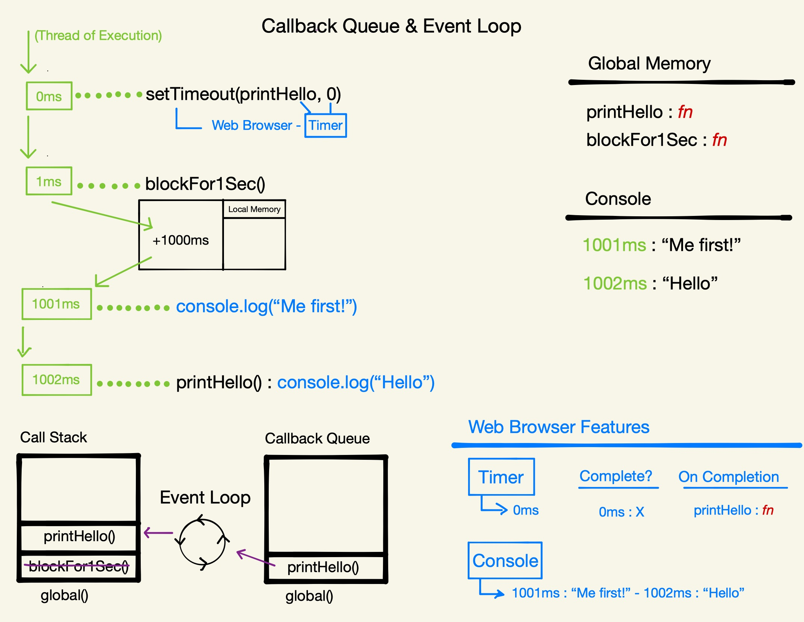

# Section 5: Asynchronous JavaScript

## Single Threaded Execution Review

### Promises, Async & the Event Loop

- Promises: the most signficant ES6 feature
- Asynchronicity: the feature that makes dynamic web applications possible
- The Event Loop: JavaScript’s triage
- Microtask queue, Callback queue and Web Browser features (APIs)

Reference article - [Tasks, microtasks, queues and schedules by Jake Archibald](https://jakearchibald.com/2015/tasks-microtasks-queues-and-schedules/)

### A reminder of how JavaScript executes code

```
const num = 3;
function multiplyBy2 (inputNumber){
	const result = inputNumber*2;
	return result;
}
const output = multiplyBy2(num);
const newOutput = multiplyBy2(10);
```

This is the same code walkthrough we saw in the beginning of the [JavaScript Principles section](./JavaScript-Principles.md). Copying here for posterity:

1. Define constant `num` and assign it the value of `3`.
2. Define function `multiplyBy2()`. When we define a function, there is two parts:
	a. define the label/identifier
	b. store all of the code in the function into memory (we do not execute anything at this point)
3. Define constant `output` and assign it the value returned by `multiplyBy2(num)`. Before we get the returned value from `multiplyBy2(num)`, that constant's value will be "uninitialized".
4. Execute `multiplyBy2(num)`, creating a new Execution Context for that function block. Inside that new Execution Context, we:
	a. Assign `inputNumber` the value of `3`. (`inputNumber` is the placeholder and is referred to as a "Parameter". `3` is the data that gets passed in to that placeholder and is called an "Argument". These two things are fundamentally different things. One is a label and one is the thing that is stored in that label.)
	b. Define constant `result` and assign it the value of the operaton on the right hand side - which is executed and evaluates to `6`.
	c. In our local memory, look up (or locate) the data (_value_) stored with the label `result` and return it (ship it out of the functions Local Execution Context into the Global Execution Context). This function execution ultimately evaluates to the _value_ returned in `result` - in this case, `6`.
5. Assign the returned value of `6` to `output`.
6. Define constant `newOutput` and assign it the value returned by `multiplyBy2(10)`.
7. Repeat step 6 for the new function call. execute `multiplyBy2(10)`, creating a new Execution Context for that function block. Inside that new Execution Context, we:
	a. Assign `inputNumber` the value of `10`.
	b. Define constant `result` and assign it the value of the operaton on the right hand side - which is executed and evaluates to `20`.
	c. In our local memory, look up (or locate) the data stored with the label `result` and return it (ship it out of the functions Local Execution Context into the Global Execution Context). This function execution ultimately evaluates to the value returned in `result` - in this case, `20`.
8. Assign the returned value of `20` to `newOutput`.

Here's the visual example of the above execution:


JavaScript is a synchronous language, meaning that when we are enter a function's Execution Context and run the code inside (line-by-line) we can not exit out and move on until that code is finished running. When we finish running the code inside of a function, we close that Execution Context and move on. _Then_ we hit the next line in Global. What if that line we're running is a really slow task? 😱

## Asynchronicity in JavaScript

Asynchronicity is the backbone of modern web development in JavaScript yet ,as we've mentioned, every single time we have a task to do, we must finish it before we move on. This is because JavaScript is Single-Threaded (one command runs at a time) and Synchronously-Executed (each line is run in order the code appears).

What if we have a task like speaking to a server, to Twitter's server, to get new tweets? We have to sit on that line, and wait for that data to come back. When it comes back, we can display it, and then we can move on to the next line. But that could take like half a second or longer. In that time we can't run any further code afterwards (until the task is complete and we can move along). That's a serious problem. And what if we have code that we want to run using those tweets?

A slow function blocks further code from running:

```
const tweets = getTweets("http://twitter.com/will/1")

// ⛔350ms wait while a request is sent to Twitter HQ
displayTweets(tweets)

// more code to run
console.log("I want to runnnn!")
```

Let's make the situation even more difficult - what if we try to delay a function directly using `setTimeout` (`setTimeout` is a built in function - its first argument is the function to delay followed by ms to delay by)?

```
function printHello(){
	console.log("Hello");
}
setTimeout(printHello,1000);
console.log("Me first!");
```

In what order will our console logs appear? In what order would our existing model of JavaScript suggest the console logs would happen. And then do you think that's actually what happens?

Our existing modle would suggest that we would be blocked for 1 second at our `setTimeout` call before logging "Hello" and then log "Me first!" right after. 

And how about if we set the wait time to `0` in our `setTimeout` call?

```
function printHello(){
	console.log("Hello");
}
setTimeout(printHello,0);
console.log("Me first!");
```

We might think the same order as with no wait time. However, in _both_ cases, we will see "Me first!" _followed by_ "Hello". Why is this?

JavaScript is not enough by itself. We need new pieces (some of which aren’t JavaScript at all).

Our core JavaScript engine has 3 main parts:

- Thread of execution
- Memory/variable environment
- Call stack

We need to add some new components:

- Web Browser APIs/Node background APIs
- Promises
- Event loop, Callback/Task queue and micro task queue 

## Asynchronous Browser Features

Where does JavaScript actually run? Where is it running its code? In the browser. We don't open an app called JavaScript. The browser is a remarkable creation - it has so much more than just JavaScript in it. When we run an application in the browser, JavaScript does not run in isolation, it has a ton of features in the web browser as well:

- Dev Tools
- Sockets
- Local Storage -> `localStorage`
- Console -> `console`
- Network Requests -> `fetch`/`XHR`
- HTML DOM (rendering) - a simplified version (in object-style format) of what is on the page so that we can interact with it (add/remove stuff, etc) -> `document`
- Timer -> `setTimeout`

While we do not program for the above features, JavaScript lets us interface with and use these features. To do so, JavaScript uses a bunch of what is called "facade" functions - functions that _look_ like they're in JS but are actually fronts/facades for Web Browser features. We get a bunch of labels in JS for each of these features. For example Timer - `setTimeout`. These features do nothing of interest in JavaScript, directly. They are just labels for those corresponding features in the web browser.

This means that a big part of what we do in JavaScript isn't even JavaScript at all. We need to expand out platform from our big three pieces in JavaScript to those big three pieces _plus_ everything that's happening in the Web Browser.

## Web API Example

### ES5 solution: Introducing ‘callback functions’, and Web Browser APIs

```
function printHello(){ console.log("Hello"); }
setTimeout(printHello,1000);
console.log("Me first!");
```

1. Define function `printHello()`.
1. At 0ms, Call/execute `setTimeout` - which is a label for the Timer feature from the Web Browser (nothing to do with JS - technically it does have a return value in JS but that's just an ID for the timer).
	1. Needs a duration (`1000ms`) to be a successful timer.
	1. On completion (callback) will run `printHello`.
1. At 1ms, call `console.log("Me first!")` - technically `console` is a web browser feature as well.
1. At 1000ms, execute `printHello` and add it to the Call Stack.
	1. Call `console.log("Hello")`.
	1. Pop `printHello` off of the Call Stack.


Here's the visual example of the above execution:


## Web API Rules

Clearly, we have a problem here where we need to have some sort of rules for when this extraordinary other world is allowing this function back into JavaScript. When (and how) is a funciton that was triggered by a Web Browser feature let back in to the Call Stack to be executed in JavaScript?

We’re interacting with a world outside of JavaScript now - so we need rules. These rules are _really_ strict but that makes our code super predictable. We fundamentally know how it's gonna behave if we know these core rules.

**Side Note:**
Any slow task in JavaScript will always be thrown out to a Web Browser feature - If we want to speak to the Internet, we're gonna do it in the background of the web browser. If we wanna do a timer, we're gonna do it in the background of the web browser so we don't block any further code in our single threaded language from running.

So how could we actually block JavaScript from running code for a period of time? A very large `for` loop would do this for us. Say maybe loop over 3 million items. This will sit on the Call Stack until it completes.

Also note that you can not do one _long_ task in JS but you can do many tiny tasks. And that's how we can block the Call Stack. This is what we're emulating in the above example.

## Callback Queue & Event Loop

```
function printHello(){ console.log("Hello"); }

function blockFor1Sec(){ //blocks in the JavaScript thread for 1 sec }

setTimeout(printHello,0);

blockFor1Sec()

console.log("Me first!");
```

1. Define function `printHello()`.
1. Define function `blockFor1Sec()` to simulate a 1 second block of the Call Stack.
1. At 0ms, Call/execute `setTimeout`.
	1. Pass in `printHello` as the callback.
	1. Pass in `0ms` as the duration.
1. At 0ms, the timer is complete and the `printHello` function is added to the Callback Queue, waiting to be added back to the Call Stack.
1. At 1ms, call `blockFor1Sec` and add it to the Call Stack - which is a function to simulate a 1 second block of the Call Stack (e.g., a long `for` loop).
1. At 1001ms, `blockFor1Sec` is complete, popped off the Call Stack and we move on to execute `console.log("Me first!")`.
1 At 1002ms, the Call Stack is empty of all synchronous code and the Event Loop can now move `printHello` from the Callback Queue on to the Call Stack to be run.
1. `printHello` is executed.
	1. `console.log("Hello")` is run.
	1. `printHello` is popped off of the Call Stack.
1. The End.

Here's the visual example of the above execution:



The Event Loop is a very tiny, yet profound, feature that constantly checks at each line, before it runs any code, to see if the Call Stack is empty. Once it is empty, it can move over the next function from the Callback Queue. The Call Stack must be empty of all of the syncronous JS code in the Global Execution Context before it can move anything over. ALL regular code will be run first before we ever touch anything from the Queue.

Don't confuse the callbacks in these Web API functions with the callbacks we see that are run in Higher-Order Functions - these Web API callback functions are just set aside (a link to where it is defined by it's label) in the Callback Queue (when ready) and thrown back on to the Call Stack to be executed in JavaScript. They are just commands. For example, in our above block of code, at no point is `printHello` actually run inside of `setTimeout`.

Until ES6 (Promises), this was the entire modle of Asynchronous JavaScript.

## Callback Queue & Event Loop Q&A

Q: Is that event loop running constantly as long as your browser is open?
A: As long as the application is running, yes

## Callback Hell and Async Exercises

### ES5 Web Browser APIs with callback functions

**Problems**

- Our response data is only available in the callback function - Callback hell
- Maybe it feels a little odd to think of passing a function into another function only for it to run much later
- Not as clean for Error Handling

A lot of the time, these background features, the function that's then automatically called, the background feature gets some data. So for example, if the background feature's speaking over the network, to get some new data in, well then, where's that data gonna show up?

That data shows up as the input, automatically inserted into the running of that printHello function. That's pretty amazing. But the problem with that is that means that data is only available inside the execution context of that printHello function. So if you've gone off to Twitter, grabbed a bunch of data, the function that's gonna run automatically own the completion of this being to Twitter in the background, the function's gonna run automatically.

It's gonna have its input be that data from Twitter. You could only use that data inside that function, because we don't get to run this function. Therefore we can't have it return anything out. Because we can't assign the return value of it anywhere.

That's pretty rough. And that's what created something known as callback hell, where we are doing all of our work on that data from Twitter, inside of one function. As we do function, inside a function, inside a function.

**Benefits**

- Super explicit once you understand how it works under-the-hood

[Exercise Challenge](csbin.io/async)
[Exercise Solution](https://github.com/CodesmithLLC/cs-bin-solutions/blob/master/async.js)

