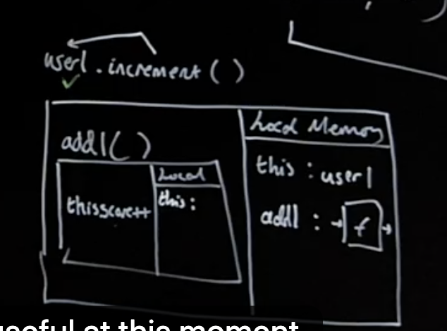
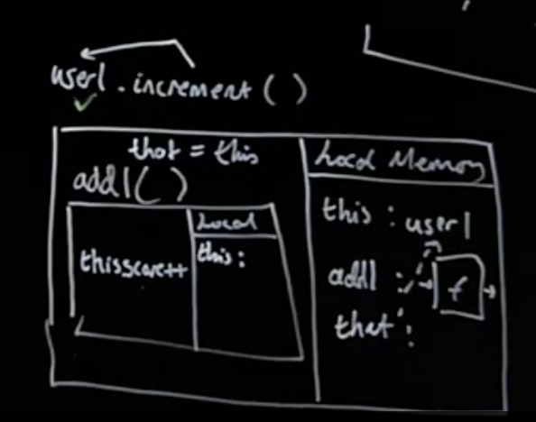
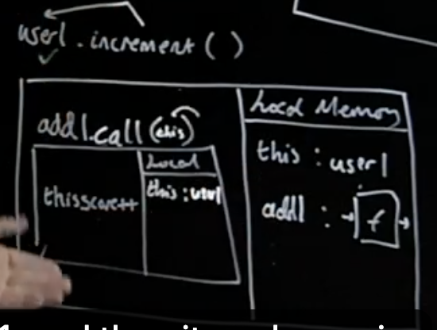
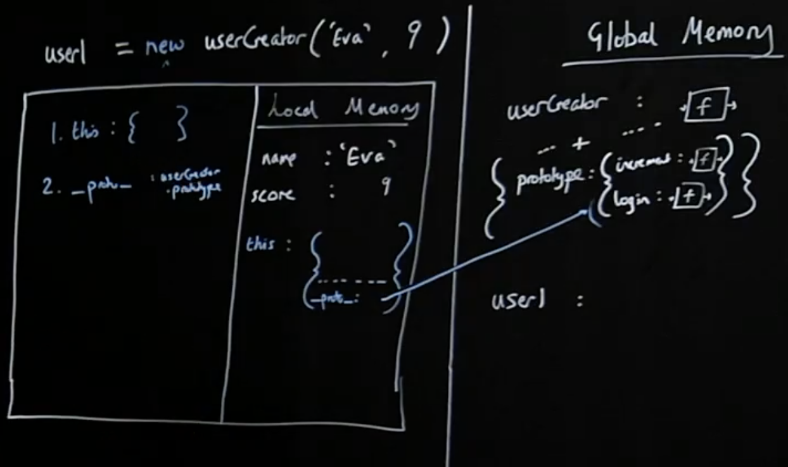
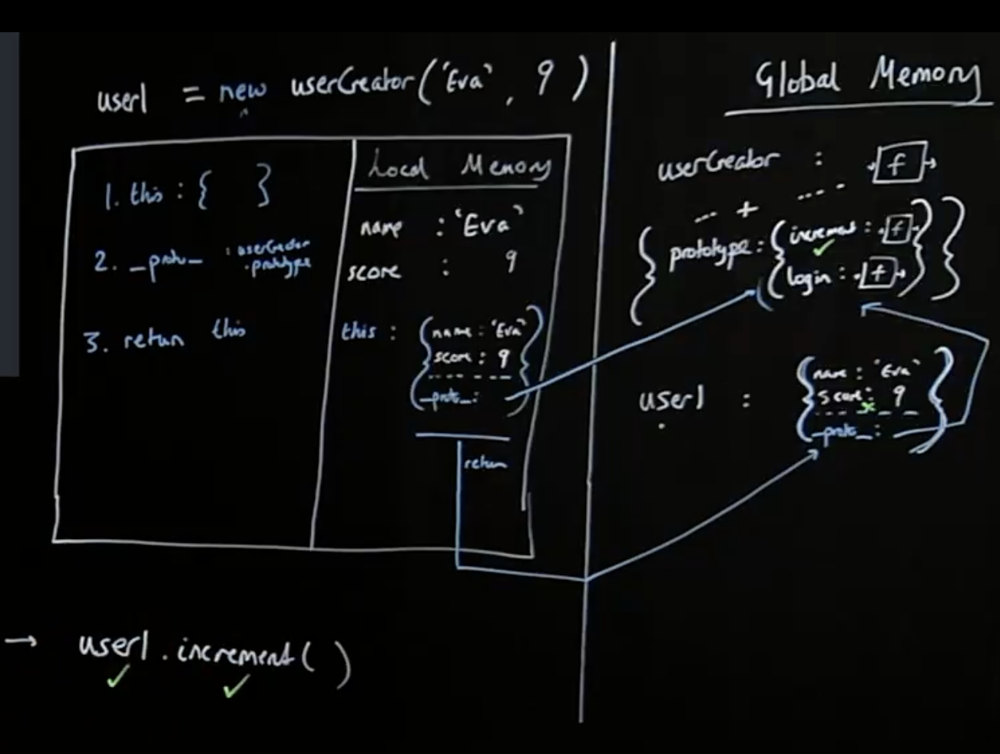

# Section 7: Classes & Prototypes

Starting at page 66 of [the slides](https://static.frontendmasters.com/resources/2019-09-18-javascript-hard-parts-v2/javascript-hard-parts-v2.pdf).

## Class & OOP Introduction

### Classes, Prototypes - Object Oriented JavaScript

- An enormously popular paradigm for structuring our complex code
- Prototype chain - the feature behind-the-scenes that enables emulation of OOP but is a compelling tool in itself
- Understanding the difference between __proto__ and prototype
- The new and class keywords as tools to automate our object & method creation

### Core of development (and running code)

1. Save data (e.g. in a quiz game the scores of user1 and user2)
2. Run code (functions) using that data (e.g. increase user 2’s score)

Easy! So why is development hard?

In a quiz game I need to save lots of users, but also admins, quiz questions, quiz outcomes, league tables - all have data and associated functionality.

In 100,000 lines of code
- Where is the functionality when I need it?
- How do I make sure the functionality is only used on the right data!

That's what makes coding so complex. So much data, so much functionality and it only applies to certain bits. And finding the right functionality and making sure it only applies to the right bit, we need some sort of organizing structure.

That is, I want my code to be:

1. Easy to reason about

But also:
2. Easy to add features to (new functionality)
3. Nevertheless efficient and performant

The Object-oriented paradigm aims is to let us achieve these three goals. And really all paradigms of code are sets of guidelines - best practices approaches.

## Object Dot Notation

So if I’m storing each user in my app with their respective data (let’s simplify):

user1:
- name: ‘Tim’
- score: 3

user2:
- name: ‘Stephanie’
- score: 5

And the functionality I need to have for each user (again simplifying!)
- increment functionality (there’d be a ton of functions in practice)

In fact, there'd be a ton of functionality here. Now, two things, I do not want to have to run all over my file of code or my files of code to try and hunt out that increment function. In my ideal world, wherever user1 is in my application right now being passed around into different bits of my application, I have that increment functionality right there adjacent to it.

How could I store my data and functionality together in one place?

### Objects - store functions with their associated data!

This is the principle of encapsulation - and it’s going to transform how we can ‘reason about’ our code:

```
const user1 = {
	name: "Will",
	score: 3,
	increment: function() { user1.score++; }
};

user1.increment(); //user1.score -> 4
```

Let's keep creating our objects. What alternative techniques do we have for creating objects?

### Creating user2 user dot notation

Declare an empty object and add properties with dot notation:

```
const user2 = {}; //create an empty object

//assign properties to that object
user2.name = "Tim";
user2.score = 6;
user2.increment = function() {
	user2.score++;
};
```

1. Define the constant `user1` and set it to an empty object.
1. Define the property `name` on the `user1` object and set it to the string "Tim".
1. Define the property `score` on the `user1` object and set it to the number 6.
1. Define the method `increment` on the `user1` object and set it to the function - passing in the entire function definition to that label (everything from the keyword `function` and on).

## Factory Functions

### Creating user3 using Object.create

`Object.create` is going to give us fine-grained control over our object later on. The only things that it does in terms of our object itself is return another object.

```
const user3 = Object.create(null);

user3.name = "Eva";
user3.score = 9;
user3.increment = function() {
	user3.score++;
};
```

1. Define the constant `user3` and set it to the return value of `Object.create(null)` - which is an empty object.
	- Note that, no matter what we pass in as an argument, it will always return out an empty object at the end. It may have some hidden properties depending on what we pass in - but always an empty object with no direct properties.
1. Define the property `name` on the `user3` object and set it to the string "Eva".
1. Define the property `score` on the `user3` object and set it to the number 9.
1. Define the method `increment` on the `user3` object and set it to the function - passing in the entire function definition to that label (everything from the keyword `function` and on).

Our code is getting repetitive, we're breaking our DRY principle. And suppose we have millions of users! What could we do? What do we tend to do whenever we're doing lines of code, again and again and again?

Put in a function. Save it once use again and again. And the only bits you want to change have those be passed in as inputs to specify when you run the function, what it's actually going to do.

The paradigm of Object Oriented Programming is not as popular increasingly as the Functional Programming style, but it is an amazing, really intuitive way of thinking about structuring an application. Application is data - user, scores, whatever functionality, the ability to change that user score, put it together. And look at it, is that right there.

But we're doing it multiple times, so now let's do the work of creating the object, save it once, and use it as many times as we want.

Note that this solution is going to turn out to be untenable. You can never use it in practice, but it gets us a long way there. Everything else we do it's just about making this much, much more efficient.

## Factory Functions Example

### Solution 1. Generate objects using a function

```
function userCreator(name, score) {
	const newUser = {};
	newUser.name = name;
	newUser.score = score;
	newUser.increment = function() {
		newUser.score++;
	};
	return newUser;
};

const user1 = userCreator("Will", 3);
const user2 = userCreator("Tim", 5);
user1.increment()
```

1. Define the function with the label `userCreator` and save it to Global memory.
1. Define the const `user1` and assign it the return value of `userCreator("Will", 3)` (it will initially be uninitialized until that function returns it's value.).
1. Execute `userCreator()`, create a new Execution Context for it with the arguments of `"Will` and `3`, and add the function `userCreator()` to the Call Stack.
1. Enter the Execution Context for `userCreator`.
	1. Assign the arguments `"Will"` and `3` to the parameters/labels `name` and `score`, respectively.
	1. Define a constant with the label `newUser` in Local Memory and assign it an empty object.
	1. Set the property `name` on the `newUser` object to be the value of the `name` parameter (the argument of `"Will"` in this case). If the property does not already exist, create it.
	1. Set the property `score` on the `newUser` object to be the value of the `score` parameter (the argument of `3` in this case). If the property does not already exist, create it.
	1. Set the property `increment` on the `newUser` object to be the value of the entire function definition block (`function() { newUser.score++ }`).
	1. Return the `newUser` object out into the Global Execution Context - which will be returned into the lable `user1`.
	1. Pop the `userCreator` function off of the Call Stack.
1. Define the const `user2` and assign it the return value of `userCreator("Tim", 5)` (it will initially be uninitialized until that function returns it's value.).
1. Once more, execute `userCreator()`, create a new Execution Context for it with the arguments of `"Tim"` and `5`, and add the function `userCreator()` to the Call Stack.
1. Enter the Execution Context for `userCreator`.
	1. Assign the arguments `"Tim"` and `5` to the parameters/labels `name` and `score`, respectively.
	1. Define a constant with the label `newUser` in Local Memory and assign it an empty object.
	1. Set the property `name` on the `newUser` object to be the value of the `name` parameter (the argument of `"Tim"` in this case). If the property does not already exist, create it.
	1. Set the property `score` on the `newUser` object to be the value of the `score` parameter (the argument of `5` in this case). If the property does not already exist, create it.
	1. Set the property `increment` on the `newUser` object to be the value of the entire function definition block (`function() { newUser.score++ }`).
	1. Return the `newUser` object out into the Global Execution Context - which will be returned into the lable `user2`.
	1. Pop the `userCreator` function off of the Call Stack.
1. Execute `user1.increment()`, create a new Execution Context for it, and add the function to the Call Stack.
1. Enter the Execution Context for `user1.increment()`.
	- Increment the `score` propert on the `newUser` object.
	- The `newUser` objext is now stored in the Global Execution Context as `user1`.
	- We still have access to the `newUser` label from within the `increment` function because the `increment` function it brought that reference out in it's "backpack" when it was returned from inside of the `newUser` object.

While this solution is super intuitive, there are two issues with it:

1. The `increment` function is getting redefined each time this is run. This is a performance issue because every time we create a new user, we make space in that computer's memory, for our data functions. But that function are just copies of the same code.
1. If we wanted to add any new features/properties, we would need to manually add to each object we've created - so that is not scalable at all.

## Prototype Chain

### Solution 2: Using the prototype chain

Store the increment function in just one object and have the interpreter - if it doesn't find the function on `user1`, look up to that object to check if it's there.

Link `user1` and `userFunctionStore` so the interpreter, on not finding `.increment`, makes sure to check up in `userFunctionStore` where it would find it.

Make the link with `Object.create()` technique.

The object that we create with `Object.create()` is still gonna be an empty object. But the fact that we're passing in `userFunctionStore`, we're somehow gonna have a link behind the scenes on this new object - i.e., anything passed into the `Object.create()` method, when called, will go onto the Prototype object of that object.

## Prototype Chain Example: Prototypal Link

Under the hood (we can see this via logging it to the console), when we create the object via `Object.create(userFunctionStore)`, an empty object is still returned into `newUser`, however we get a _hidden_ property on the object. This object is called `__proto__`. This `__proto__` property has a link to `userFunctionStore`. Now every object created with this appoach will have the link back to the `userFunctionStore` object and be able to use the properties and methods on this object.

When JavaScript does not find a proprty/method on an object, it automatically looks up the Prototype Chain via the `__proto__` object to see if it an find it there, wasting memory.

This handy feature allows us to write code where we can create as many objects as we want and the methods on those objects will not need to be redefined over and over again.

Note that this `__proto__` property is not to be confused with "prototype". They are not one-in-the-same.

```
function userCreator (name, score) {
	const newUser = Object.create(userFunctionStore);
	newUser.name = name;
	newUser.score = score;
	return newUser;
};

const userFunctionStore = {
	increment: function(){this.score++;},
	login: function(){console.log("Logged in");}
};

const user1 = userCreator("Will", 3);
const user2 = userCreator("Tim", 5);
user1.increment();
```

1. Define the function with the label `userCreator` and save it to Global memory.
1. Define the const `userFunctionStore` in Global Memory and assign it an Object literal with two properties
	- `increment`: a function/method that increments the `score` property.
	- `login`: a function/method that loggs the String "Logged in".
1. Define the const `user1` and assign it the return value of `userCreator("Will", 3)` (it will initially be uninitialized until that function returns it's value.).
	1. Assign the arguments `"Will"` and `3` to the parameters/labels `name` and `score`, respectively.
	1. Define a constant with the label `newUser` in Local Memory and assign it an empty object.
	1. Set the property `name` on the `newUser` object to be the value of the `name` parameter (the argument of `"Will"` in this case). If the property does not already exist, create it.
	1. Set the property `score` on the `newUser` object to be the value of the `score` parameter (the argument of `3` in this case). If the property does not already exist, create it.
	1. Note there is no `increment` method/property directly on this object - however, we do somehow (which we'll see in a bit) get a "special link" (via `__proto__` - see above) back to the `userFunctionStore` object that was passed in via the `Object.create(userFunctionStore)`.
	1. Return the `newUser` object out into the Global Execution Context - which will be returned into the lable `user1`.
	1. Pop the `userCreator` function off of the Call Stack.
1. Define the const `user2` and assign it the return value of `userCreator("Tim", 5)` (it will initially be uninitialized until that function returns it's value.).
	1. Assign the arguments `"Tim"` and `5` to the parameters/labels `name` and `score`, respectively.
	1. Define a constant with the label `newUser` in Local Memory and assign it an empty object.
	1. Set the property `name` on the `newUser` object to be the value of the `name` parameter (the argument of `"Tim"` in this case). If the property does not already exist, create it.
	1. Set the property `score` on the `newUser` object to be the value of the `score` parameter (the argument of `5` in this case). If the property does not already exist, create it.
	1. Note there is no `increment` method/property directly on this object - however, we do somehow (which we'll see in a bit) get a "special link" (via `__proto__` - see above)  back to the `userFunctionStore` object that was passed in via the `Object.create(userFunctionStore)`.
	1. Return the `newUser` object out into the Global Execution Context - which will be returned into the lable `user2`.
	1. Pop the `userCreator` function off of the Call Stack.
1. Call/execute the `user1.increment()` method, create a new Execution Context, and add it to the Call Stack. JS will go through the following lookup process:
	1. Locate `user1` in Global Memory.
	1. Look for the `increment` method on that object and we do not find it.
	1. Follow the "special link" (via `__proto__` - see above) to the `userFunctionStore` object where we find the `increment` method, grab the code, and execute it - here we create the Execution Context, and add it to the Call Stack.
		1. _From here on is from the following section_
		1. Run the code `this.score++` to increment the `score` property.
			- `this`, as noted below, is an implicit parameter - which is one that is automatically there and filled in for us.
			- In this context, the `this` parameter will always be filled in with the Object that is calling that method - the Object immediately to the left hand side of the dot of the function that is being run.
			- What makes this special is that it allows us the flexibility to reference all of the different Objects that we create, without needing to duplicate code and reference those objects by their name, directly.
			- So, in our Local Memory, we now have an implicit parameter called `this` that gets filled with `user1`.
		1. Increment the `score` property on the `user1` object that lives on the Global Execution Context.

## Prototype Chain Example: Implicit Parameters

Reiterating from above, the argument that `Object.create()` accepts is always stored in the `__proto__` hidden property. 

`Object.create()` always creates and empty object with a hidden `__proto__` property. Note this is not _as_ hidden as our Lecical `[[scope]]` property or our `onFulfilled` array. You can actully view this property in the console, unlike the latter two - for example if you `console.log( user1 )`, you'll see this property.

An implicit parameter is one that is automatically there and filled in for us. It's called `this`. On our `increment` method, we see `this` being used to increment `score`. This is filled in by the Object that is calling that method (the object immediately to the left hand side). So when it is called on `user1`, the `this` parameter will be filled in with the `user1` object as an argument (`user1.score++`). Same for `user2` (`user1.score++`), and so forth and so on.

All functions and Global automatically have a `this` implicit parameter. Aside from one other main interesting case we'll cover in a later lesson, there's not much more there is to it.

If we were to use `this` randomly inside of the `userCreator` function (or whatever global function), we'd be referencing something random on the Global object (aka Window). But when used in this prototypal approach with our `__proto__` property, it can be very useful in storing and referencing code to be used by multiple objects.

We have to acknowledge that if we're going to take this model - if we're going to organize our code, there will still be tradeoffs (as with anything):
	- Benefit: all fof the data / functionality / the availability of that functionality are bundled in one place.
	- Problem: around the functionality, it can have consequences anywhere in the code base - ideally , only within the object we're trying to target.

All-in-all, maintaining this sort of code base can be definitely have its ups and downs.

## hasOwnProperty Method

What if we want to confirm our user1 has the property score?

```
function userCreator (name, score) {
	const newUser = Object.create(userFunctionStore);
	newUser.name = name;
	newUser.score = score;
	return newUser;
};
const userFunctionStore = {
	increment: function(){this.score++;},
	login: function(){console.log("Logged in");}
};
const user1 = userCreator("Will", 3);
const user2 = userCreator("Tim", 5);
user1.hasOwnProperty('score');
```

We can use the `hasOwnProperty` method - but where is it? As it turns out, there's a big headline Object in JavaScript (we'll see exactly where it's stored later on) that's called `Object.prototype`. This has a bunch of functions that will be available to all of our Objects. This is similar to what Wes Bos referrs to at the "Momma Array". How?

This is because _all_ objects in JS (not just the ones in our example that we explicitly set) have a `__proto__` property. This is a default one that defaults to linking to this main `Object.prototype`. So the `userFunctionStore` also had a default `__proto__` property that links down to this main `Object.prototype` property - which has the `hasOwnProperty` method on it.

In the above code, when we execute the `user1.hasOwnProperty('score')`, we:

- Look for `user1`, which we find in our Global Memory.
- Then we look for `hasOwnProperty` on the `user1` object, which we do not find.
- From there, we look for `hasOwnProperty` on the `__proto__` property, which is set as `userFunctionStore`. We do not find it there either.
- We then go looking for `hasOwnProperty` on the `__proto__` (default) property on on `userFunctionStore` - this links to the main `Object.prototype` Object. Here is where we find it, grab all of the code from that label, and run it.

What we're actually doing with our `object.create` method is kinda taking control of what we put in that `__proto__`. Because all Objects by default, via their `__proto__`, as soon as they're created gets a link to `object.prototype`. In addition, we don't lose access to the default properties on the main object because it is a chain all the way up. Random note - the `object.prototype` Object also has a `__proto__` property - which is `null`, because we're all the way up at the top of the chain at this point.

In (Object Oriented - Hard Parts)[https://frontendmasters.com/courses/object-oriented-js/], we go into greater detail - also covering how Arrays and Functions have a big collection of shared functions we can use.

## this Keyword

### Create and invoke a new function (add1) inside increment

```
function userCreator(name, score) {
	const newUser = Object.create(userFunctionStore);
	newUser.name = name;
	newUser.score = score;
	return newUser;
};
const userFunctionStore = {
	increment: function() {
	function add1(){ this.score++; }
		add1()
	}
};
const user1 = userCreator("Will", 3);
const user2 = userCreator("Tim", 5);
user1.increment(); 
```

Note that we simplified the `userFunctionStore` a little bit by removing everything except for the `increment` method. So what does this get auto-assigned to?

We may run into scenarios where we would want to create/run additional functions inside our `increment` method. Doing so, will cause some interesting issues.

In this case, because we've created a nested Execution Context for `add1`, the `this` property loses the context of `user1` and looks out to the main `Object.prototype` Object, which is the Global context - this is because the `add1()` function does not have an explicitly set `__proto__` property set on it, like we did with `userFunctionScore`. It does, however, have the default `__proto__` property, which points to the main `Object.prototype`, where `this` references the Global `this` - the Global `window` object.

So we'd end up attaching to this funny Global Object called Window, a property on it, `score`. Which would then be `undefined` by default, and we'd try and increment it.

This is one of those arguably, maybe not the best earlier implementations of JavaScript. Especially as in other languages it's absolutely standard that while you're inside the method, the pertinent object, the object that we care about doing stuff to with the data, is throughout, going to be the object that we're running the method on. Even if we declare other functions inside and run them, they're this in their local memory. But no, the this in the local memory here.

There are a few ways we can handle this - `call()`, `apply()`, `bind()`, and there was an older approach where people would set `this` to `that` (or `self`) and reference it instead of `this` because it would be found on the parent Execution Context, in that case.

- Call: https://developer.mozilla.org/en-US/docs/Web/JavaScript/Reference/Global_Objects/Function/call
- Apply: https://developer.mozilla.org/en-US/docs/Web/JavaScript/Reference/Global_Objects/Function/apply



**that Example**



**call() Example**



__Note: Redo above screenshot examples in GoodNotes.

## Arrow Function Scope & This

The Arrow Function style, of declaring or saving functions, is lexically scoped - rather, it's `this` assignment is lexically scoped. That is to say, when we save the function and we execute it, what this is set to is determined by where the function was saved.

So in our example above, if it was saved where `this` is `user1` - when we end up running it, the `this` inside will be the `this` value from where the function was saved, which is `user1`.

Below is an example:

### Arrow functions override the normal this rules

```
function userCreator(name, score) {
	const newUser = Object.create(userFunctionStore);
	newUser.name = name;
	newUser.score = score;
	return newUser;
};
const userFunctionStore = {
	increment: function() {
	const add1 = () => { this.score++; }
		add1()
	}
};
const user1 = userCreator("Will", 3);
const user2 = userCreator("Tim", 5);
user1.increment();
```

Now, because we defined our inner function with an Arrow Function, it gets its `this` set by where it was saved - it’s a lexically scoped `this`.


One simple rule is any function that's being run to the right hand side of a dot (as in calling it as a method of an object), whatever the left hand side that's going to be the `this` assignment.

But when there's no dot there, it defaults the Global/Window Object. Unless that function was defined as an Arrow Function, in which case it will look up to whatever `this` was referencing where it was defined - in the above example, the `this` inside of `add1` looks up to the `this` that is set to `user1` on the `increment` function because that is what `this` was in the context that `add1` was defined.

**What if we set `increment` as an arrow function?**

If we ran it, would it's this assignment be determined by where it's being run to the right hand side of the dot or by where it was stored, which was in Global?

By where it was stored. Therefore the whole thing would fall apart - `this` will not be `user1`.

So we don't want to use Arrow Functions for our methods on objects. But for the functions inside of them, when we want to point the `this` to the method in which they were defined, Arrow Functions are perfect.

## Prototype Chain Review

### Summarizing Solution 2: Using the prototype chain

**Problems:** No problems! It's beautiful. Maybe a little long-winded

**Benefits:** Super sophisticated but not standard


In an interview you can say to your interviewer, "I prefer this because I want more fine grained control over my writing of my oxygen that I tend to try and follow this approach". And they're gonna go, they're gonna think, "Ugh, the worst". But, at the same time, they're gonna go, "Ah, impressive!"

This isn't to say it is the right way, it's certainly not standard. And I would not be suggesting you use this but it's gonna turn out to be the answer to what's really happening when we do use the standard way of achieving this same goal.

The next solutions will be handling everything we covered here for us. Which means, in order to debug it, you have to understand it. If you want to properly answer, "What is the `new` keyword doing under the hood?" you have to know all of this stuff. The `new` keyword is what automates all of this hard work we're doing that could become a repatitive on a larger scale.

## new Keyword

If we look back, we had creating the object manually using `object.create`, storing in a new user. By the way, just a temporary name for it,they never get stuck with that name. Returning out that object manually, we wrote the code for that as well. Creating a bond to use a function store.

Wouldn't it be nice if we could automate that stuff?

### Solution 3 - Introducing the keyword that automates the hard work: `new`

When we call the function that returns an object with new in front we automate 2 things

1. Create a new user object
2. Return the new user object

But now we need to adjust how we write the body of userCreator - how can we:

- Refer to the auto-created object?
- Know where to put our single copies of functions?

It's gonna create a new object for us automatically. It's gonna return that object out for us automatically. It's also gonna make the link to some object full of functions and set the `__proto__` property, automatically for us, as well. But to where? Before, we manually set that object that we stored in `newUser` to have it's hidden `__proto__` property linked to `userFunctionStore`. But now that won't be the case so where will we put out shared store of functions, if we're not manually creating an object (`userFunctionStore`).

Also, we previously stored this object with the label `newUser`. Now we will not be manually creating a label for this object. So where will we link off to and what will this object be automatially given as a label?

### The `new` keyword automates a lot of our manual work

```
function userCreator(name, score) {
	~~const newUser = Object.create(functionStore);~~
	~~newUser~~ this.name = name;
	~~newUser~~ this.score = score;
	~~return newUser;~~
};
~~functionStore~~ userCreator.prototype // {};
~~functionStore~~ userCreator.prototype.increment = function(){
	this.score++;
}
const user1 = new userCreator("Will", 3);
```

The object that is returned out will be given the label as `this`. This is the other key rule of how `this` works. It's always whatever the object is to the left of the dot when we run a method, that this is implicitly assigned to the `user1`. It has one other role, if we use a `new` keyword, the automatically created object inside of that Execution Context is gonna label `this`, but they're totally separate.

### Interlude - functions are both objects and functions

```
function multiplyBy2(num){
	return num*2
}

multiplyBy2.stored = 5
multiplyBy2(3) // 6
multiplyBy2.stored // 5
multiplyBy2.prototype // {}
```

We could use the fact that all functions have a default property `prototype` on their object version, (itself an
object) - to replace our `functionStore` object

Functions are both objects and functions in JavaScript. It turns out as soon as that JavaScript sees that keyword function, knows a function is coming, we get a function plus, a big old object attached.

- If we use parens at the end of the function label, we get access to the function part.
- If we use the dot at the end of the function label, we get access to the attached object.

All functions, in their object format, automatically have a property on them called `prototype`. It's not a hidden property, it's a property on the object part. It defaults to be a big empty object.

This being said, where would it make the most sense for the `new` keyword's auto-created object inside the running of the `userCreator` function to have it's `__proto__` connectin be linking to, if it can't specify that it's `userFunctionStore`?

On the `prototype` property of the function that we're then going to run with the `new` keyword on, such that it creates an automatic object inside - and that's gonna have a bond for its `__proto__` property to that `prototype` property, which is an object.

The `__proto__` is going to not link to use the function store we created earlier, but link up to this object.


### The new keyword automates a lot of our manual work

We can think of the `new` keyword as a modifier - it alters the behavior of the user creator execution context - it's gonna insert stuff in there automatically for us when we run it.

A function definition is always a combination of a function plus an object. Every time we define a funciton, we get this object part with it. It's not an empty object - it has a `prototype` property on it, which is an empty object, itself. This happens with every function definition. We don't talk about this object part as often but it's there.

If we want to store something on that object, we reference it via the dot notation - `userCreator.prototype.labelName`, where `labelName` is whatever we want that label to be. What are we doing here because we're gonna use this object like how use a function store was for a single vert save version of each function.

That we want any objects that get returned from running user creator to have access to any stored functions in here.

Assigning a label to a function call with the `new` keyword in front of it is still doing the same old process of creating a new Executon Context - the `new` keyword is just automating all of that stuff inside of the new Exectuion Context. The function then evaluates to the returned object that is automatically created with the `this` label.

Let's walk through the execution of the below example:

```
function userCreator(name, score) {
	this.name = name;
	this.score = score;
}

userCreator.prototype.increment = function() { this.score++; };
userCreator.prototype.login = function() { console.log("login"); };

const user1 = new userCreator(“Eva”, 9);

user1.increment();
```

1. Define the function with the label `userCreator` and save it to Global memory that implicitly is a Function/Object combo.
	- The function's object has a `prototype` property on it, in which an empty object is stored. We can reference this by `userCreator.prototype` (see next).
1. Lookup `userCreator` and find it in Global Memory. Then access it's `prototype` object and create a property called `increment`, where we store a function definition (a method).
1. Lookup `userCreator` and find it in Global Memory. Then access it's `prototype` object and create a property called `login`, where we store a function definition (a method).
1. Define a constant `user` in Global Memory and assign it the return value of `userCreator("Eva", 9)` (which is run with the `new` keyword) - will be "unitialized" until the `userCreator` returns a value into it.
1. Execute `userCreator`, create a new Execution Context for `userCreator`, and add `userCreator` to the Call Stack.
1. Enter the Executon Context for `userCreator`.
	1. Assign the parameter `name` with the argument value of `"Eva"`.
	1. Assign the parameter `score` with the argument value of `9`.
		- Note that these parameters are not properties or anything special, they're just regular inputs for a function.
	1. Create an empty object with the label `this`.
		- Remember the main purpose for this function is to return an object. So we need to make it flexible - we don't want to manually define the property names each time. That's what `this` does for us - as a generic label.
	1. The object with the label `this` has a hidden `__proto__` property, which is set as a link back to the object part of the `userCreator` function - more specifically it's `prototype` property (which is an object full of the functions that we put in there). So `__proto__` will be the label for `userCreate.prototype`. .
		- Note that this is all automated by the `new` keyword for us.
	1. In Local Memory, create the property with the label `name` on the `this` object and assign it the value of the `name` parameter - which evaluates to the argument that was passed in - `"Eva"` in this case.
	1. In Local Memory, create the property with the label `score` on the `this` object and assign it the value of the `score` parameter - which evaluates to the argument that was passed in - `9` in this case.
	1. Return the `this` object (automated by the `new` keyword) into the Global label `user1`.
1. Pop `userCreator` off of the Call Stack - remove the Execution Context.
1. Call `user1.increment()`.
	- Find the label `user1` in Global Memory.
	- Look for the method `increment` on `user1` - it is not there.
	- Look for the method `increment` via the `__proto__` hidden property, which points up to the `userCreator` object's `prototype` property - which is an object with the properties we stored on it earlier, `increment` being one of these.
	- Take the `increment` code, run it, create an Execution Context for it, and add it to the Call Stack.
		- Inside the Execution Context for `increment`, we do the same lookup for the `score` label.



To summarize, when we define a function, it automatically has an object attached to it and we can access it's properties via the dot notation. This object automatically has a property on it called `prototype` which is an empty object by default. When we run this function with the `new` keyword, it will create a new Execution Context and then automate every thing we manually did earlier within that execution context. It will have a bond to it's `__proto__` property to that `prototype` property, which is an Object. The function will evaluate to the returned object that is automatically created, with the `this` label.

__Important Note__: If we ran the `userCreator` function without the `new` keyword, the `this` inside would point to the Global/Window Object - since the `new` keyword is automating everything. This isn't great because it may not be immediately obvious that a function definition requires a `new` keyword to work properly. To help with this, developers would historically capitalize a constructor function to indicate that it required the `new` keyword in front of it to work as intended.


Benefits:
- Faster to write. Often used in practice in professional code

Problems:
- 95% of developers have no idea how it works and therefore fail interviews
- We have to upper case first letter of the function so we know it requires `new` to work!

## class Keyword

### Solution 4: The `class` "syntactic sugar"

We’re writing our shared methods separately from our object "constructor" itself (off in the `userCreator.prototype` object).

Other languages let us do this all in one place. `ES2015` lets us do so too. Note that this new approach is puerly syntactical - it doesn't change anything under the hood.