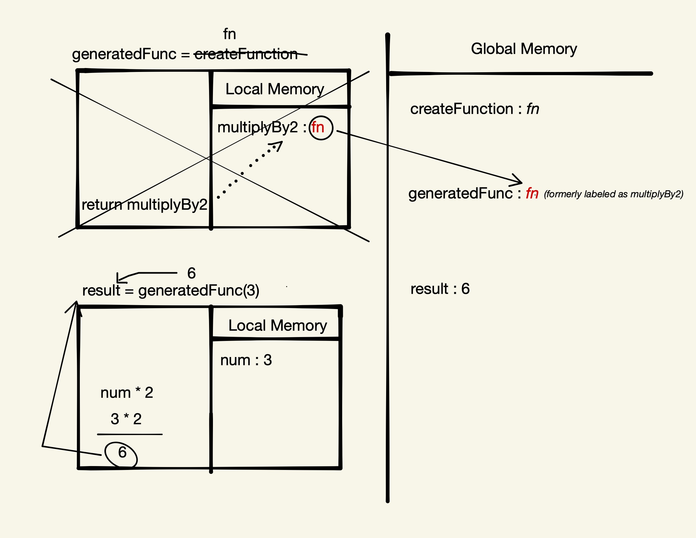
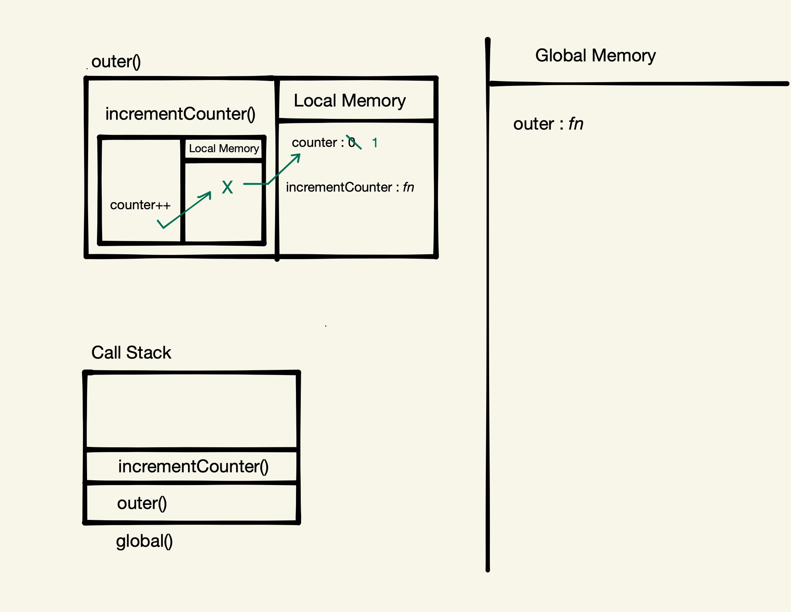
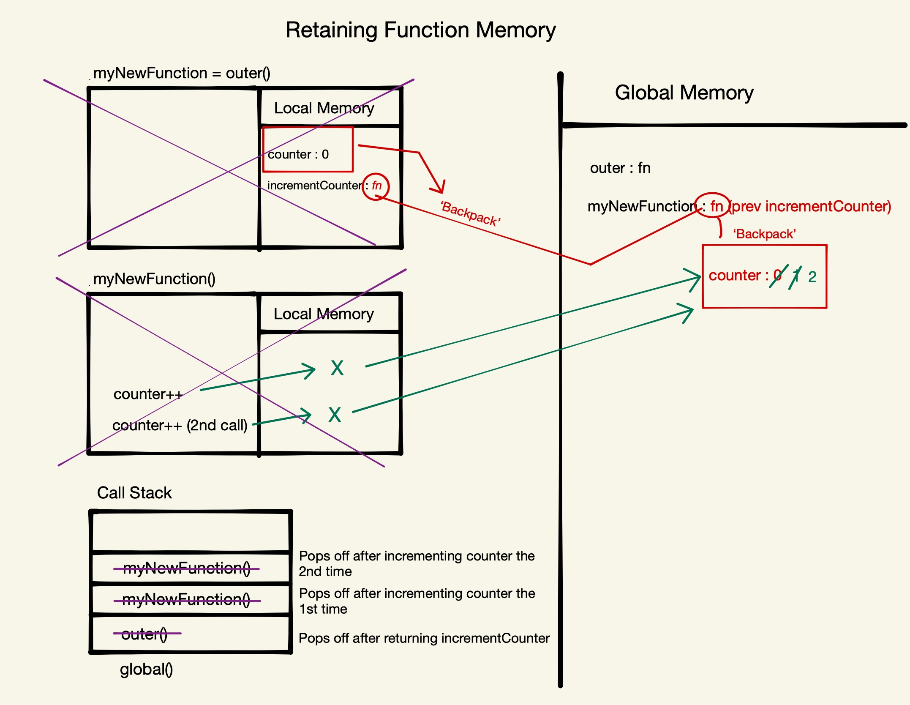
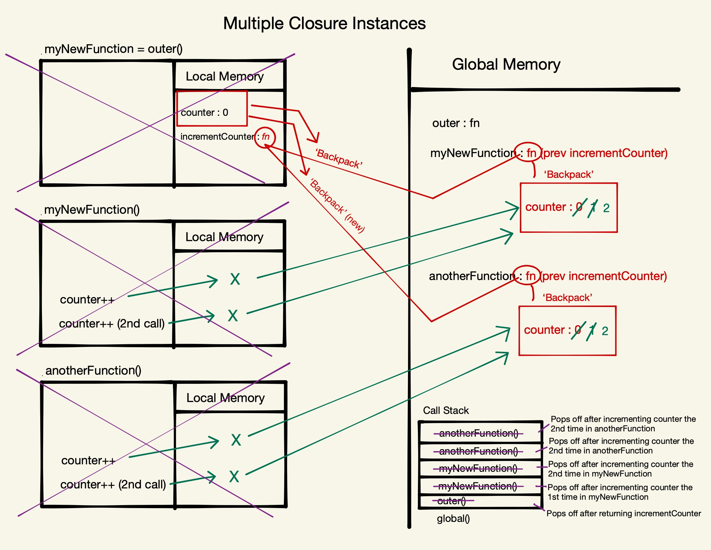

# Section 4: Closure

## Closure Introduction

Closure is the most esoteric of JavaScript concepts. If you understand it well, you can do some really powerful things.

It enables powerful pro-level functions like ‘once’ and ‘memoize’. Many JavaScript design patterns including the module pattern use closure. Building iterators, handling partial application and maintaining state in an asynchronous world all depend on Closure.

### Functions with memories

When our functions get called, we create a live store of data (local memory/variable environment/state) for that function’s execution context. When the function finishes executing, its local memory is deleted (except the returned value).

Side note - whenever you hear about the term `state` (application state), it's one of those really bizarre terms, that just means, the live data at that particular moment, given moment in my application, that's being stored.

But what if our functions could hold on to live data between executions?

This would let our function definitions have an associated cache/persistent memory. But it all starts with us **returning a function from another function**.

## Returning Functions

In JavaScript, we can return functions from within another function. This is a really big part of understanding Closure (and JS). Once we really get this notion down, everything else follows easily. 

Let's walk through (line-by-line) an example:

```
function createFunction() {
	function multiplyBy2 (num) {
		return num*2;
	}
	return multiplyBy2;
}
const generatedFunc = createFunction();
const result = generatedFunc(3); // 6
```

1. Define the function with the label `createFunction` and save it to Global memory.
1. Define the constant with the label `generatedFunc` and save it to Global memory.
1. Define the constant with the label `generatedFunc`, save it to Global memory, and assign it the return value of `createFunction()`.
1. Create a new execution context for `createFunction` and add the function to the call stack.
1. Enter the new execution context for `createFunction`, define a new function with the label `multiplyBy2`, and save that new function to Local Memory.
1 Return the entire function with the label `multiplyBy2` out to the Global Execution Context and assign back to the `generatedFunc` label. **Important Note**: Here we are returning out the _value_ of what is stored in Local Memory with the label/identifyier `multiplyBy2`. A function definition is actually a value - a thing that can be stored. We're not returning the label itself - that is just how it is being located (see diagram below). The value (the entire function definition itself) is what is being returned out (everything _after_ the `multiplyBy2` label). So `generatedFunc` is going to be a new label in the Global Execution Context for the function originally born as `multiplyBy2`.
1. Remove `createFunction` from the Call Stack (it still lives in Global Memory and can be called again but we're not using it anymore in this program).
	1. Back out in the Global Execution Context, we have a function assigned to `generatedFunc` which, for all intents and purposes, was formerly known as `multiplyBy2` in the Local Memory / EC of `createFunction`. Globally, this same funciton is only known as `generatedFunc` (this also includes the parameter `num`). From this point in our code, `generatedFunc` has no connection to `createFunction` - zero relationship at all. The code we get from `multiplyBy2` was simply what was returned out when it was run that one time. But JS is a synchronous language - it executes once and moves on.
1. Define the constant with the label `result` and assign it the return value of `generatedFunc(3)`.
1. Create a new execution context for `generatedFunc`, add the function to the call stack, and enter the new Execution Context.
1. Assign the argument value of `3` to the parameter `num`.
1. Multiply `3 * 2` (`6`) and return the result back out to the Global Execution Context and assign it to the `result` constant.

Here's a visual example of the above execution:



So why did we save a nicely semantically (that means kind of meaningfully named) function inside another function, only to then return it out, giving it a really bad name out and use it globally? Why didn't we just define it globally in the first place?

It turns out, when that function gets returned out, it gets the most powerful property, bonus feature, of JavaScript that we can ask for.

## Nested Function Scope

Here we look at an example of calling a function in the same function call as it was defined:

```
function outer (){
	let counter = 0;
	function incrementCounter (){
		counter ++;
	}
	incrementCounter();
}
outer();
```

Let's have a walk-through the above function line-by-line:

1. Define the function with the label `outer` and save it to Global memory.
1. Call `outer()`, create a new execution context for it, and add the function to the call stack.
1. Enter the new execution context for `outer`
1. Define a new variable with the label `counter`, set the value to `0`, and save it to Local Memory.
1. Define a new function with the label `incrementCounter`, and save that new function to Local Memory.
1. Call `incrementCounter()`, create a new execution context for it, and add the function to the call stack.
1. Increment `counter` via `counter++`.
	1. JavaScript looks for `counter` in the Local Memory / Execution Context (in `incrementCounter`) first.
	1. When it does not find `counter` there, it then looks to the next parent Execution Context (in `outer`) and finds it there in that parent function's Local Memory.

Here's a visual example of the above execution:



The key takeaway is that where you define your functions determines what data it has access to when you call it.

## Retaining Function Memory

Now we take a look at calling a function outside of the function call in which it was defined. This will illustrate how function memory is treated/retained.

```
function outer (){
	let counter = 0;
	function incrementCounter () { counter ++; }
	return incrementCounter;
}
const myNewFunction = outer();
myNewFunction();
myNewFunction();
```

Let's have our usual walk-through the above function line-by-line:

1. Define the function with the label `outer` and save it to Global memory.
1. Define a new constant with the label `myNewFunction`, assign it to the return value of the invocation of `outer()` (we don't have that value just yet), and save it to Local Memory.
1. Call `outer()`, create a new execution context for it, and add the function to the call stack.
1. Enter the new execution context for `myNewFunction`.
1. Define a new variable with the label `counter`, set the value to `0`, and save it to Local Memory.
1. Define a function with the label `incrementCouter` and save it to Local Memory.
1 Return the entire function (_value_) with the label `incrementCounter` out to the Global Execution Context and assign back to the `myNewFunction` label.
1. `outer()` is then popped off of the Call Stack (pop is a fancy word for removed and push is a fancy word for added).
1. Call `myNewFunction()`, create a new execution context for it, and add the function to the call stack. At this point, `myNewFunction` label essentially contains the following code: `function() { counter++; }`.
1. Inside of the (now named) `myNewFunction` function (formly known as `incrementCounter` from inside `outer`), we run `counter++` to increment the counter value.
	1. JavaScript looks for `counter` in the Local Memory / Execution Context (in `incrementCounter`) first.
	1. When it does not find `counter` there, before it moves up to the parent/containing function's Execution Context, it looks in it's "backpack" of memory (see below) that it took with it when it was defined inside of `incrementCounter` and returned out. When a function is defined, it gets a bond to the surrounding Local Memory (“Variable Environment”) in which it has been defined. It still has access to that data and it brings it out with it into Global Memory to persist and live there. Forever and ever and ever.
	1. Now, in our Global (scoped) memory that lives in the "backpack" of the label that is globally stored as `myNewFunction`, the `counter` label is now set to the value of `1`.
1. `myNewFunction()` is then popped off of the Call Stack 
1. Call `myNewFunction()` once more, create a new execution context for it, and add the function to the call stack.
1. Inside of the subsequent call to `myNewFunction` function (formly known as `incrementCounter` from inside `outer`), we run `counter++` to increment the counter value once again.
	1. JavaScript again looks for `counter` in the Local Memory / Execution Context (in `incrementCounter`) first.
	1. When it does not find `counter` there, before it moves up to the parent/containing function's Execution Context, it looks in it's "backpack" of memory (see below) that it took with it when it was defined inside of `incrementCounter` and returned out. 
	1. Now, in our Global (scoped) memory that lives in the "backpack" of the label that is globally stored as `myNewFunction`, the `counter` label is now set to the value of `2`.
1. The secont call to `myNewFunction()` is then popped off of the Call Stack.

**The bond**

When a function is defined, it gets a bond to the surrounding Local Memory (“Variable Environment”) in which it has been defined. This is live data at this point.

**The ‘backpack’**

In our example above, we return incrementCounter’s code (function definition) out of outer into global and give it a new name - `myNewFunction`. We maintain the bond to outer’s live local memory - it gets ‘returned out’, attached on the back of `incrementCounter`’s function definition.

So outer’s local memory is now stored attached to `myNewFunction` - even though outer’s execution context is long gone. When we run `myNewFunction` in global, it will first look in its own local memory first (as we’d expect), but then in `myNewFunction`’s ‘backpack’.

When we search for some bit of data in our Local Scope that is not there, this property interceeds and we then look there before moving out to the next level up in Execution Context / Memory. This data persists - it isn't removed like an Execution Context's temporary memory - it permanently sticks around, as long as the function definition it is attached to is not overwritten. Permanent and Private memory.

The only way we can access it, however, is by running the function it is attached to (via it's backpack) and hoping that function was written in a way when it was defined that if it looks for something that does not exist in Local Memory, it will look to the `[[scope]]` property (on the backpack). We can not access this `[[scope]]` property directly.

Here's a visual example of the above execution:



## Closure Q&A

**Q**: If you had a secondary Execution Context wrapping, could you have a backpack on the second level?
**A**: Yes, it is a chain - we will learn the technical name for this chain shortly.

**Q**: Could we pass in a Callback function that will then have access to the data in the Backpack?
**A**: Yes, this is what is referred to as Function Decorators. Absolutely, you can literally store code in the backpack as well. And that's what enables carrying, partial application and function decoration techniques. All of them sit on this - on us passing a function in which ends up in the brand new returned out function's backpack.

And that is the decoration process, which is different to how other languages handle decoration. Decoration is where you edit a function, or appear to - in reality what you're doing, brand new function that uses the decorated, the change function from his backpack.

Watch the Functional Programming Hard Parts for much more detailed demonstration of this.

**Q**: Error propagation, we're nesting a bunch of calls, we're nesting a bunch of operations. I can still make an access error on those variables, I can still ask for an MSE in an array that doesn't exist. But now we've got a chain of references to propagate our error through.
**A**: Yeah, I mean this is this is one of the interesting challenges is that when we all using traditional console logging, I find console log my new function. It's got a bunch of state data attached to it that I don't get to see on my console. That's gonna be pretty hard to debug.

Unless we know what's happening, of course. Now, kindly the chrome dev tools do give us the ability to pause our execution at this moment. And if we do, we'll see the contents of the backpack on the right-hand side. They give it the official name.

**Q**: What if we create a constant/variable that isn't every called in the function that is returned out ... does that data still get added into the backpack?
**A**: No - JavaScript knows exactly the moment of returning out what could ever be accessed in that backpack. And so in modern versions of, the implementations of JavaScript in the chrome engine and other engines as well, I think for 39 on. JavaScript optimizes, what is put into the backpack. The link is made the entire local memory, and it's just a link to where that stops.

That would be what's called a memory leak. That is a say specifically, use space in the computer's memory. With a label, you've got data used with a label, where we can't ever act as that label anymore. That data would be completely inaccessible, as it is literally just wasting space in the computer's memory. That's what a memory leak is.

## Closure Technical Definition & Review

All right, so let's talk about what this backpack is called - there is a colloquial name used by developers for it. 

However, it's vague and imprecise. It refers to both of the overall concept, and they call the backpack this as well. They refer to the thing that results in the backpack existing and they call the backpack itself all this same umbrella term, which is a bit vague and confusing.

**What can we call this ‘backpack’?**

There are a few names that are used to refer to this feature:

- Closed Over Variable Environment (C.O.V.E.)
	- "Variable Environment" is what is often used to refer to the Local Memory
- Persistent Lexical Scope Referenced Data (P.L.S.R.D.)
	- Scope is the rule in any programming language for what data you have available to you at any given line of code. How this works may differ between languages. The language of JS has a very particular scope rule called Lexical (or Static) Scoping. This is to say that where a function is saved determines (for the life of that function) whenever it gets run, under whatever new label it gets, the data it will have access to when that function runs. This is why we get the 'backpack' of data when we return a function - we need to pull that data (that is being used by the function) out and return it along with the returned function. We don't have this data because we go back into the previous Execution Context, we don't do that. We take that data along with us and that's how we get it - in the backpack (our lexically scoped `[[scope]]` propery).
	- If the available data were to chage based on where it was run, that would be called Dynamic Scoping.
- ‘Backpack’
- ‘Closure’ - which is the more commonly used name in the industry for this concept - the problem is that they call the overall concept this along with the `[[scope]]` property (the backpack itself) as well.

The ‘backpack’ (or ‘closure’) of live data is attached incrementCounter (then to `myNewFunction`) through a hidden property known as `[[scope]]` (hidden properties are always surrounded by the double brackets). This hidden property links to where all of the surrounding "backpack" data is stored and it is still attached when the inner function is returned out and given it's new Global label.

If you define a new label (variable/constant) and assign it to the returned function with the backpack, it still has access to the backpack and everything. It's simply creating another label for that function/data. For example: `const anotherFunction = myNewFunction;`.

Side note: If we were to return multiple functions (in an Array of functions or an Object with methods for example), each of those functions would have access to the same backpack.

## Multiple Closure Instances

Let’s run outer again:

```
function outer (){
	let counter = 0;
	function incrementCounter (){
		counter ++;
	}
	return incrementCounter;
}

const myNewFunction = outer();
myNewFunction();
myNewFunction();

const anotherFunction = outer();
anotherFunction();
anotherFunction();
```

Let's have our usual walk-through the above function line-by-line. Note that everything is exactly the same in steps 1-13 as our prevuous example. We pick up at step 14 with the second instance of `outer()`.

1. Define the function with the label `outer` and save it to Global memory.
1. Define a new constant with the label `myNewFunction`, assign it to the return value of the invocation of `outer()` (we don't have that value just yet), and save it to Local Memory.
1. Call `outer()`, create a new execution context for it, and add the function to the call stack.
1. Enter the new execution context for `myNewFunction`.
1. Define a new variable with the label `counter`, set the value to `0`, and save it to Local Memory.
1. Define a function with the label `incrementCouter` and save it to Local Memory.
1 Return the entire function (_value_) with the label `incrementCounter` out to the Global Execution Context and assign back to the `myNewFunction` label.
1. `outer()` is then popped off of the Call Stack (pop is a fancy word for removed and push is a fancy word for added).
1. Call `myNewFunction()`, create a new execution context for it, and add the function to the call stack. At this point, `myNewFunction` label essentially contains the following code: `function() { counter++; }`.
1. Inside of the (now named) `myNewFunction` function (formly known as `incrementCounter` from inside `outer`), we run `counter++` to increment the counter value.
	1. JavaScript looks for `counter` in the Local Memory / Execution Context (in `incrementCounter`) first.
	1. When it does not find `counter` there, before it moves up to the parent/containing function's Execution Context, it looks in it's "backpack" of memory (see below) that it took with it when it was defined inside of `incrementCounter` and returned out. When a function is defined, it gets a bond to the surrounding Local Memory (“Variable Environment”) in which it has been defined. It still has access to that data and it brings it out with it into Global Memory to persist and live there. Forever and ever and ever.
	1. Now, in our Global (scoped) memory that lives in the "backpack" of the label that is globally stored as `myNewFunction`, the `counter` label is now set to the value of `1`.
1. `myNewFunction()` is then popped off of the Call Stack 
1. Call `myNewFunction()` once more, create a new execution context for it, and add the function to the call stack.
1. Inside of the subsequent call to `myNewFunction` function (formly known as `incrementCounter` from inside `outer`), we run `counter++` to increment the counter value once again.
	1. JavaScript again looks for `counter` in the Local Memory / Execution Context (in `incrementCounter`) first.
	1. When it does not find `counter` there, before it moves up to the parent/containing function's Execution Context, it looks in it's "backpack" of memory (see below) that it took with it when it was defined inside of `incrementCounter` and returned out. 
	1. Now, in our Global (scoped) memory that lives in the "backpack" of the label that is globally stored as `myNewFunction`, the `counter` label is now set to the value of `2`.
1. The secont call to `myNewFunction()` is then popped off of the Call Stack

1. Define another new constant with the label `anotherFunction`, assign it to the return value of the invocation of `outer()` (we don't have that value just yet), and save it to Local Memory.
1. Call `outer()`, create a new execution context for it, and add the function to the call stack.
1. Enter the new execution context for `anotherFunction`.
1. Define a new variable with the label `counter`, set the value to `0`, and save it to Local Memory.
1. Define a function with the label `incrementCouter` and save it to Local Memory.
1 Return the entire function (_value_) with the label `incrementCounter` out to the Global Execution Context and assign back to the `anotherFunction` label.
1. `outer()` is then popped off of the Call Stack (pop is a fancy word for removed and push is a fancy word for added).
1. Call `anotherFunction()`, create a new execution context for it, and add the function to the call stack. At this point, `anotherFunction` label essentially contains the following code: `function() { counter++; }`.
1. Inside of the (now named) `anotherFunction` function (formly known as `incrementCounter` from inside `outer`), we run `counter++` to increment the counter value.
	1. JavaScript looks for `counter` in the Local Memory / Execution Context (in `incrementCounter`) first.
	1. When it does not find `counter` there, before it moves up to the parent/containing function's Execution Context, it looks in it's "backpack" of memory (see below) that it took with it when it was defined inside of `incrementCounter` and returned out. When a function is defined, it gets a bond to the surrounding Local Memory (“Variable Environment”) in which it has been defined. It still has access to that data and it brings it out with it into Global Memory to persist and live there. Forever and ever and ever.
	1. Now, in our Global (scoped) memory that lives in the "backpack" of the label that is globally stored as `anotherFunction`, the `counter` label is now set to the value of `1`.
1. `anotherFunction()` is then popped off of the Call Stack 
1. Call `anotherFunction()` once more, create a new execution context for it, and add the function to the call stack.
1. Inside of the subsequent call to `anotherFunction` function (formly known as `incrementCounter` from inside `outer`), we run `counter++` to increment the counter value once again.
	1. JavaScript again looks for `counter` in the Local Memory / Execution Context (in `incrementCounter`) first.
	1. When it does not find `counter` there, before it moves up to the parent/containing function's Execution Context, it looks in it's "backpack" of memory (see below) that it took with it when it was defined inside of `incrementCounter` and returned out. 
	1. Now, in our Global (scoped) memory that lives in the "backpack" of the label that is globally stored as `anotherFunction`, the `counter` label is now set to the value of `2`.
1. The secont call to `anotherFunction()` is then popped off of the Call Stack.

Here's a visual example of the above execution:



**Individual backpacks**

When we run `outer` again and store the returned `incrementCounter` function definition in `anotherFunction`, this new `incrementCounter` function was created in a new execution context and therefore has a brand new, independent "backpack". The "backpack" for `myNewFunction` and `anotherFunction` are to totally different, independent "backpacks".

**Data lookup**

One thing to take note of - when JavaScript looks for data, it stops as soon as it hits what it's looking for. For example, if, inside of `incrementCounter`, we set `counter` to `0` before incrementing it, the value would be set to `1` each time it was run (it would be reset to `0` and then incremented to `1`). JavaScript would find that `counter` value in the Local Memory and not look any further to find the data stored in the "Backpack".

Same deal if we were only to declare `counter` in Global Memory - we would look in Local Memory, then the Backpack, then out to Global Memory, if we don't find it in any of the previous locations. The value would, in that case, make it all the way to `4` because it would be referencing the same `counter` data each time.

## Practical Applications

Closure gives our functions persistent memories and entirely new toolkit for writing professional code. Some practical applications of Closure include:

- **Helper functions**: Everyday professional helper functions like ‘once’ and ‘memoize’
	- An example of a `once` function would be if we checked from our returned function if counter (from our "backpack") had been incremented the first time. If it has, we would return and prevent an additional incrementation.
	- Memoization is a standart CS practice where, if we have a large task or calculation that may need to be run more than once, instead of rerunning (or recalculating), we can wrap that function definition in a closure and store the into which we have an object with key and value pairs to store and keep track of the calculated data - only doing the hard work of the initial calculation the first time. This gives our functions persistent memories of their previous input output combinations. The example in the lesson was figuring out a prime lunber at a random and very large position.
- **Iterators and generators**: Which use lexical scoping and closure to achieve the most contemporary patterns for handling data in JavaScript.
	- Iterators a very elegant way of accessing data - we can loop through some data and set up our function that only gives us the value of that position and not bother with the index. The "backpack" is where the counter and position data is stored but we only return out the element/value that we care about.
	- With Generators, we can appear that we are pausing the execution of a function. Running a function is really just it's memory and the line we are at in the funciton. If we were to want to go back to a function, all we really need is what was in memory. Because we store all the live data in the backpack, when you come back and start running it again, it just grabs a day from the backpack and there is all your data is you went and you are back in the function.
- **Module pattern**: Preserve state for the life of an application without polluting the global namespace - this is a design pattern that preserves state (that's live data) for the life of the application without polluting the global namespace. The Module Pattern is one of many of these patterns. What it does is protect the application state inside of "backpacks" to be interfaced with throughout the runtime of that application - but only through a very, very clean interface of running that function - and making sure you pass in the right stuff, to get access, and store and persist data in the backpack. The Node Module Pattern is all just using Closure and the "backpack".
- **Asynchronous JavaScript**: Callbacks and Promises rely on closure to persist state in an asynchronous environment. What this means is in an async job, you often send off a task that's goin to complete long in the future. When it does, you're going to run a function on that data. You may want to use data that was there when that function was initially set up and the task was initially set up. That data is held on to in the function's backpack. 

## Closure Exercise

[CS Bin Exercise](http://csbin.io/closures)
[Exercise Solutions (GitHub Repo)](https://github.com/CodesmithLLC/cs-bin-solutions/blob/master/closures.js)