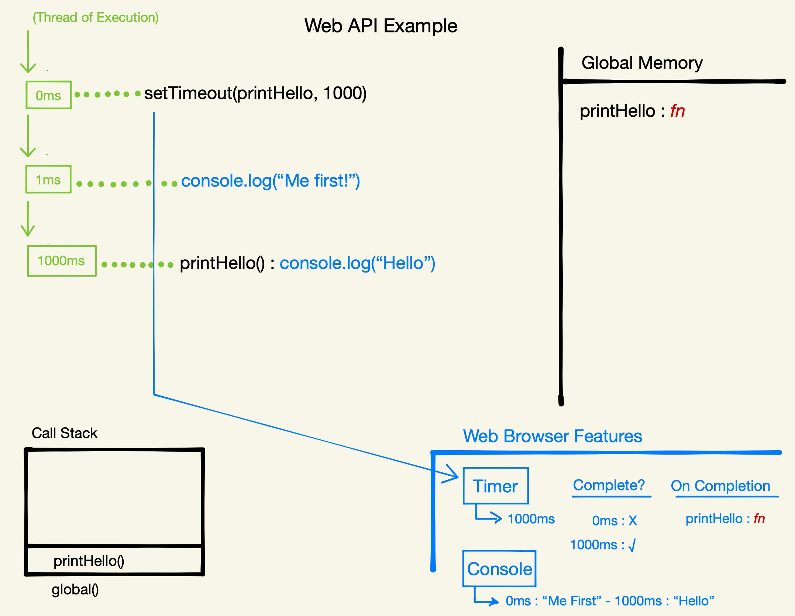

# Section 6: Promises

Starting at page 58 of [the slides](https://static.frontendmasters.com/resources/2019-09-18-javascript-hard-parts-v2/javascript-hard-parts-v2.pdf).

## Promises Introduction

Before ES6, we only had the model we saw in the [Asynchronous JavaScript section](./Asynchronous-JavaScript.md). Then, in ES6, along came Promises and everything got a little bit different.

ES6+ Solution (Promises) uses two-pronged ‘facade’ functions that both:

- Initiate background web browser work and
- Return a placeholder object (promise) immediately in JavaScript

The problem with the previous modle is that, once we've set up a feature (e.g., a timer) in the web browser, how do we keep track of the fact that we've started it (or any other background features for that matter)? JavaScript kinda just throws them out.

We can `console.log` state and data and JavaScript using the console but we can't go and visualize all the stuff that is happening in the Web Browser Features. There's no `console.visualize` for the web browser, which is that is a little bit odd, right? Half of what you're doing (more than half, really) in JavaScript is happening there.

There's no way of mapping what we're doing with the state (the data in JavaScript memory) and the everything that's happening over in the Web Browser.

In terms of developer reasoning and thinking about what we're doing as we go and maintaining an application at scale, that isn't that ideal.

This may be one of the absolute most valuable pieces that Promises offer (they have other benefits as well) - the ability to say, when you trigger something in the background, don't just throw it out there but have it have some sort of consequence in JavaScript memory as well. That way we have a consistency between things going on in background (it's gonna have some consequence back in JavaScript at some point) and we're now somehow keeping track of that within JavaScript memory as well.

So with ES6, we introduced what we'll call "Two-Pronged Facade Functions".

An example of one of these "Two-Pronged Facade Functions" is the `fetch()` function/label. This is the Web Browser label for making Network Requests. There was/is a way to go this under the previous modle that we covered and that was under the label `xhr`. With `fetch`, we use the "two-pronged" approach. That is, it still sets up the network request through the browser, however it also has a consequence in JavaScript, immetiately. It does this by returning out a special placeholder JavaScript Object called a Promise Object that will sit in out memory. When the background work in the Web Browser is done, it will fill in and update that Promise Object's data with the data from the background work (e.g., the network request).

This is how we can know what is going on in the Web Browser work because we're keeping it up-to-date in the Promise Object in memory.

## Promises Example: Fetch

```
function display(data){
	console.log(data)
}
const futureData = fetch('https://twitter.com/will/tweets/1')
futureData.then(display);

console.log("Me first!");
```

1. Define function `display()` with the parameter `data`.
1. Define constant `futureData` and set it to the return value of the `fetch()` call. It is initially "unitialized" but this tells us that the `fetch` call on the right hand side, the facade function that triggers stuff in the background, it must also do something in JavaScript. Because the result of it in JavaScript at that moment is stored on the left hand side. So it must be two pronged in some way - two consequences.
	- The `fetch` function is a facade function - not an actual native JavaScript function. It will do some JS work for us automatically but it will also do some background work in the Web Browser.
	- It will immediately return out a Promise object. It's just an object that is automatically created by `fetch`.
	- The Promise Object has 2 properties:
		1. `value`, which is initally undefined
		2. `onFulfilled`, which is hidden but super important - it is an empty array, initially.
	- The _other_ consequence of the `fetch` function takes place in the Web Browser - which is to actually make the network call to the API and get the requested data.
	- When the background task completes, the data that is returned is placed into the `value` property of the Promise Object.

---

1. At 0ms, Call/execute `setTimeout` - which is a label for the Timer feature from the Web Browser (nothing to do with JS - technically it does have a return value in JS but that's just an ID for the timer).
	1. Needs a duration (`1000ms`) to be a successful timer.
	1. On completion (callback) will run `printHello`.
1. At 1ms, call `console.log("Me first!")` - technically `console` is a web browser feature as well.
1. At 1000ms, execute `printHello` and add it to the Call Stack.
	1. Call `console.log("Hello")`.
	1. Pop `printHello` off of the Call Stack.


Here's the visual example of the above execution:

