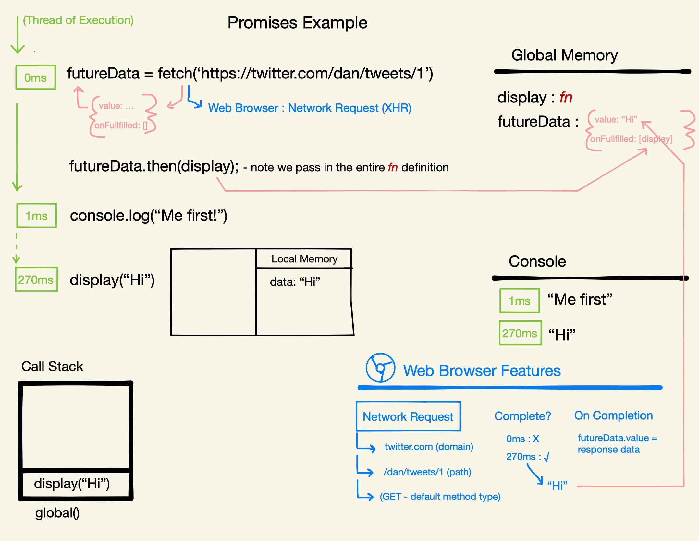

# Section 6: Promises

Starting at page 58 of [the slides](https://static.frontendmasters.com/resources/2019-09-18-javascript-hard-parts-v2/javascript-hard-parts-v2.pdf).

## Promises Introduction

Before ES6, we only had the model we saw in the [Asynchronous JavaScript section](./Asynchronous-JavaScript.md). Then, in ES6, along came Promises and everything got a little bit different.

ES6+ Solution (Promises) uses two-pronged ‘facade’ functions that both:

- Initiate background web browser work and
- Return a placeholder object (promise) immediately in JavaScript

The problem with the previous modle is that, once we've set up a feature (e.g., a timer) in the web browser, how do we keep track of the fact that we've started it (or any other background features for that matter)? JavaScript kinda just throws them out.

We can `console.log` state and data and JavaScript using the console but we can't go and visualize all the stuff that is happening in the Web Browser Features. There's no `console.visualize` for the web browser, which is that is a little bit odd, right? Half of what you're doing (more than half, really) in JavaScript is happening there.

There's no way of mapping what we're doing with the state (the data in JavaScript memory) and the everything that's happening over in the Web Browser.

In terms of developer reasoning and thinking about what we're doing as we go and maintaining an application at scale, that isn't that ideal.

This may be one of the absolute most valuable pieces that Promises offer (they have other benefits as well) - the ability to say, when you trigger something in the background, don't just throw it out there but have it have some sort of consequence in JavaScript memory as well. That way we have a consistency between things going on in background (it's gonna have some consequence back in JavaScript at some point) and we're now somehow keeping track of that within JavaScript memory as well.

So with ES6, we introduced what we'll call "Two-Pronged Facade Functions".

An example of one of these "Two-Pronged Facade Functions" is the `fetch()` function/label. This is the Web Browser label for making Network Requests. There was/is a way to go this under the previous modle that we covered and that was under the label `xhr`. With `fetch`, we use the "two-pronged" approach. That is, it still sets up the network request through the browser, however it also has a consequence in JavaScript, immetiately. It does this by returning out a special placeholder JavaScript Object called a Promise Object that will sit in out memory. When the background work in the Web Browser is done, it will fill in and update that Promise Object's data with the data from the background work (e.g., the network request).

This is how we can know what is going on in the Web Browser work because we're keeping it up-to-date in the Promise Object in memory.

## Promises Example: Fetch & Then

```
function display(data){
	console.log(data)
}
const futureData = fetch('https://twitter.com/will/tweets/1')
futureData.then(display);

console.log("Me first!");
```

1. Define function `display()` with the parameter `data`.
1. Define constant `futureData` and set it to the return value of the `fetch()` call. It is initially "unitialized" but this tells us that the `fetch` call on the right hand side, the facade function that triggers stuff in the background, it must also do something in JavaScript. Because the result of it in JavaScript at that moment is stored on the left hand side. So it must be two pronged in some way - two consequences.
1. Call the `fetch('https://twitter.com/will/tweets/1')`.
	- The `fetch` function is a facade function - not an actual native JavaScript function. It will do some JS work for us automatically but it will also do some background work in the Web Browser.
	- It will immediately return out a Promise object. It's just an object that is automatically created by `fetch`.
	- The Promise Object has 2 properties:
		1. `value`, which is initally undefined
		2. `onFulfilled`, which is hidden but super important - it is an empty array, initially.
	- The _other_ consequence of the `fetch` function takes place in the Web Browser - which is to actually make the network call to the API and get the requested data.
	- When the background task completes, the data that is returned is placed into the `value` property of the Promise Object.
1. Call `futureData.then(display)` to push the `display` function definition to the `unFulfilled` array (see below).
1. Call `console.log("Me First")` (at about 1ms).
1. At about 270ms, our data from Twitter comes back (it comes back in object form but we can get the data from that object). This response data, however, is stuck in the Web Browser. It gets back into JS by automatically populating the `value` property on the Promise Object (`futureData.value`).
	- When the `futureData.value` property is updated, this triggers the functions in the `futureData.onFulfilled` array to run (with the data in `value` property as the argument for each function).
1. At 270ms, call `display("Hi")`, create a new execution context for it, and add the function to the call stack.
	- In the Local Memory, the data from the `value` property ("Hi") is passed in as an argument and saved with the label `data`.
1. Finally, log "Hi" to the console via the `console.log(data)` call in the `display` function.

Here's the visual example of the above execution:



- Promises are special objects built into JavaScript that get returned immediately when we make a call to a web browser API/feature (e.g. fetch) that’s set up to return promises (not all are)
- Promises act as a placeholder for the data we expect to get back from the web browser feature’s background work

**then**

The `.then()` method and functionality to call on completion:

- Any code we want to run on the returned data must also be saved on the promise object
- Added using .then method to the hidden property ‘onFulfilment’
- Promise objects will automatically trigger the attached function to run (with its input being the returned data 

We didn't just get that data from Twitter to not use it. We got it to use it, display it, whatever it might be. But we don't know when that data's gonna come back. It could come back any time. So we're gonna need JavaScript to automatically run some code on that data it does come back and get stored in a property. It turns out that this empty array in the `onFulfilled` property is also super important. This empty array is gonna have any code (functions) that we want to have automatically triggered (with the help of JavaScript) to run when the `value` property gets filled in.

These functions will automatically trigger at the moment the data comes back from Twitter updates the `value` property. In JavaScript, you can store functions in a list. The data that comes back and is stored in the `value` property is automatically inserted as the input, as the argument to fill in the parameter of any function that's stored in the `onFulfilled` array.

Because this `onFulfilled` is a hidden propery, we can not `push` these functions to it directly. Luckily, JavaScript gives us a built in method that will grab whatever we pass to it as input and stick it in the `onFulfilled` array. Behind the scenes, however, `push` is used to add that data to the array - `futureData.onFulfilled.push()`. This method is the `.then()` method. We'll see later where this method comes from.


## Web APIs & Promises Example: Fetch, Then, and the Microtask Queue

We need to know how our promise-deferred functionality gets back into JavaScript to be run. To do this, lets refactor a previous example to use a Promise (via `fetch`):

```
function display(data){console.log(data)}
function printHello(){console.log("Hello");}
function blockFor300ms(){/* blocks js thread for 300ms }

setTimeout(printHello, 0);

const futureData = fetch('https://twitter.com/will/tweets/1')
futureData.then(display)

blockFor300ms()
console.log("Me first!");
```

This code block requires 3 different functions to properly demonstrate the rules in which our async deferred code will run.

Side note: The term "asynchronous" means that we run code out of order in which we saw it - from when it was said to be done. Typical, sychronous code, said handle that functionality when you hit that line that the function is called. Asynchronicity says that JS will handle that funcitonality when that code comes _back_ in - when that background work is done. And it will be out of order from when you trigger the browser feature to start it's work - _after_ all of our regular code is run.

1. Define the function with the label `display(data)` (with one property labeled as `data`, in this case) and save it to Global memory. 
1. Define the function with the label `printHello()` and save it to Global memory. 
1. Define the function with the label `blockFor300ms()` and save it to Global memory. 
1. At 0ms, Call/execute `setTimeout` - which is a label for the Timer feature in the Web Browser, which is single-pronged and does nothing in JS, itself.
	- It has a duration of `0ms`.
	- On completion, after 0ms in this case, the callback will add `printHello` to the Callback Queue - which will sit there until all of the synchronous code is complete and the Call Stack is empty.
	- Once the Call Stack is empty, the Event Loop will push `printHello` over to the Call Stack to be executed.
1. Define constant `futureData` and set it to the return value of the `fetch()` call. It is initially "unitialized" but this tells us that the `fetch` call on the right hand side, the facade function that triggers stuff in the background, also does something in JavaScript.
1. Call the `fetch('https://twitter.com/will/tweets/1')`.
	- The `fetch` function is a facade function - not an actual native JavaScript function. It will do some JS work for us automatically but it will also do some background work in the Web Browser.
	- It will immediately return out a Promise object (into `futureData`). It's just an object that is automatically created by `fetch`.
	- The Promise Object has 2 properties:
		1. `value`, which is initally undefined but will be populated with the data that comes back from the Web Browser Feature (Network Request, here).
		2. `onFulfilled`, which is hidden but super important - it is an empty array, initially. When we populate it with some functionality, those functions will be auto-triggered when the `value` property is updated. The data from that property, once returned, will be passed into the function(s) in `onFulfilled`, via the Response Object, as an argument. The Network Request is sent off at roughly 0ms.
	- The _other_ consequence of the `fetch` function takes place in the Web Browser - which is to actually make the network call to the API and get the requested data (defaults to a `GET` request).
	- When the background task completes, the data that is returned is placed into the `value` property of the Promise Object.
1. Call `futureData.then(display)` to push the `display` function definition to the `onFulfilled` array.
	- Pass in the data from the Response Object now stored in `value` as the argument for the `display` function.
1. Call `blockFor300ms` (at about 2ms), create and enter a new Execution Context for it, and add it to the Call Stack - this will simulate blocking the Call Stack for 300ms.
	- While we're inside of this Execution Context, pausing any other synchronous execution, the response from the `fetch` call comes back, at roughly 270ms, with data from the Twitter API (the string "Hi" in this example).
	- `futureData.value` is then populated with this response object/data.
	- When `futureData.value` is updated, the functions stored in `futureData.onFulfilled` are automatically triggered and pushed to the Microtask Queue with the response data passed in as the argument labeled `data`.
1. At 302ms, exit/return from `blockFor300ms` and pop it off of the Call Stack.
1. Run `console.log("Me first!")` at approx. 302ms.
1. At 303ms, our Event Loop checks the Call Stack and sees that it is empty.
	- From there, it then first checks the Microtask Queue (a different queue from the Callback/Task Queue). This is where the two-pronged functions are pushed to. If it is empty, it moved on to the Callback/Task Queue.
	- The Event Loop sees the `display` function waiting on the Microtask Queue, dequeues it, and pushes it to the Call Stack, where it is executed.
1. The `display` function is executed, a new Execution Context is created and entered,  and the data/response object from `futureData.value` is passed in as an argument to populate the `data` parameter/label ("Hi" in this example).
	- `console.log(data)` is run inside of this Execution Context and the value "Hi" is logged to the Console.
	- Exit/return from `display` and pop it off of the Call Stack.
1. At 304ms, with the Call Stack and the Microtask Queue now empty, the Event Loop now moves down to check the Callback/Task Queue where it finds out `printHello` function patiently/eagerly waiting (for 304ms now - despite having a timeout of 0ms).
1. `printHello()` is executed, added to the Call Stack, and a new Execution Context is created for it.
	- `console.log("Hello")` is run from inside this new Execution Context and "Hello" is logged to the Console.
1. Exit/return from the `printHello` Execution Context and pop it off of the Call Stack.
1. El Fin - this concludes the entire modle of Asynchronous JavaScript.

Here's the visual example of the above execution:


## Promises and Asynchronous Q & A

